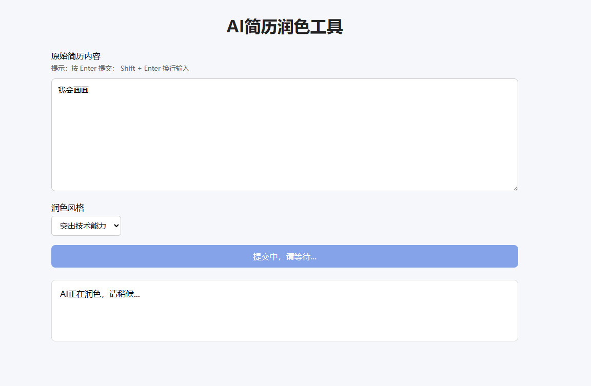
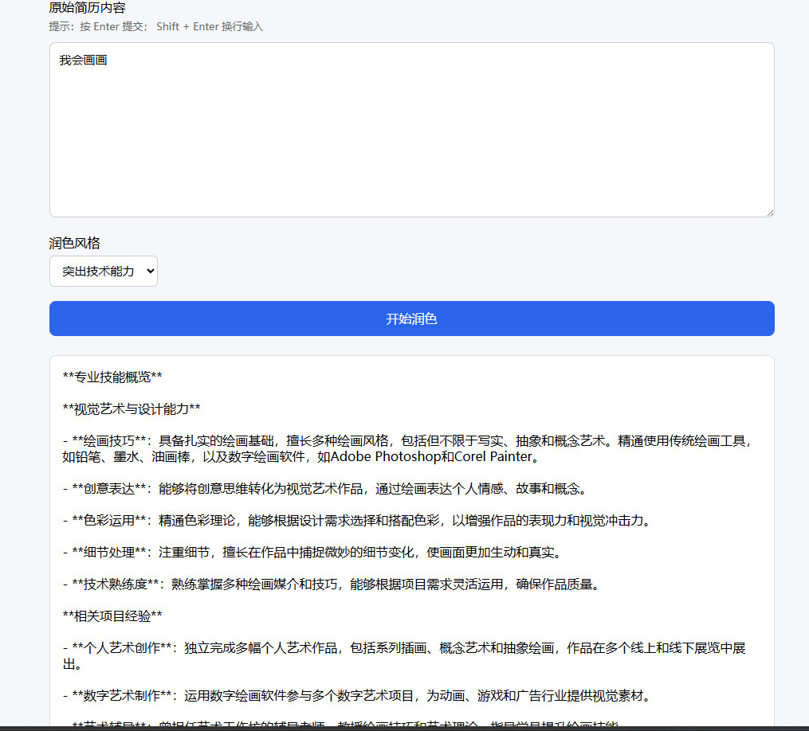

# ai-resume-polish
Flask+大模型AI简历润色网页工具
## 📸项目演示截图



## ✨项目功能
- 网页表单输入原始简历文本
- 调用大模型API自动优化简历措辞、润色语句
- 网页端直接展示润色完成结果
- 简单美观前端交互界面

## 🛠技术栈
- Python Flask：Web后端服务
- requests：调用大模型API接口
- HTML/CSS：前端页面

## 📂项目目录
resume_ai_demo/
├── app.py          # Flask主程序
├── llm_api.py      # 大模型API封装
├── start.bat       # Windows一键启动脚本
├── requirements.txt # 依赖库
├── .gitignore      # 忽略密钥、缓存文件
└── templates/
└── index.html  # 前端网页

## 🚀运行教程
1. 安装依赖
```bash
pip install -r requirements.txt
2. 配置密钥
 
本地新建 .env 文件填入你的API密钥，密钥不上传到代码仓库
 
3. 启动项目
Windows双击  start.bat 
 
4.浏览器访问
http://127.0.0.1:5000
